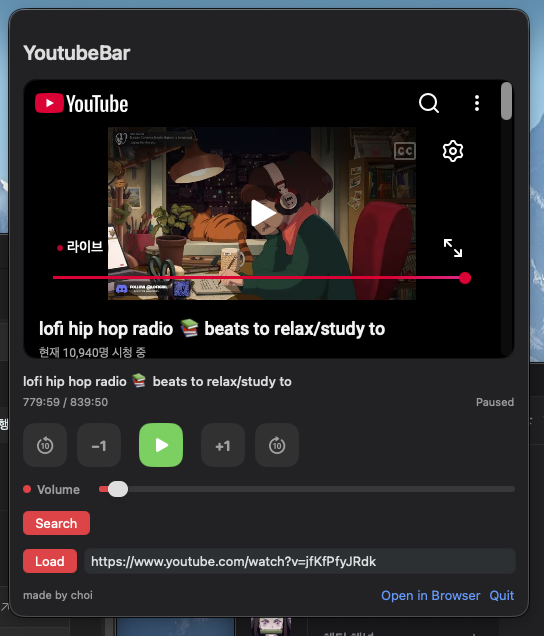

# YoutubeBar

YoutubeBar is a lightweight macOS menu bar app for playing and controlling YouTube from the top bar.

## Demo



## Install

1. Clone this repository:

```bash
git clone https://github.com/choimagon/YoutubeBar.git
cd YoutubeBar
```

2. Build the app bundle:

```bash
chmod +x ./scripts/build_app.sh
./scripts/build_app.sh
```

This creates `dist/YoutubeBar.app`.
You can launch it immediately after the build finishes.

3. Open the app:

```bash
open dist/YoutubeBar.app
```
